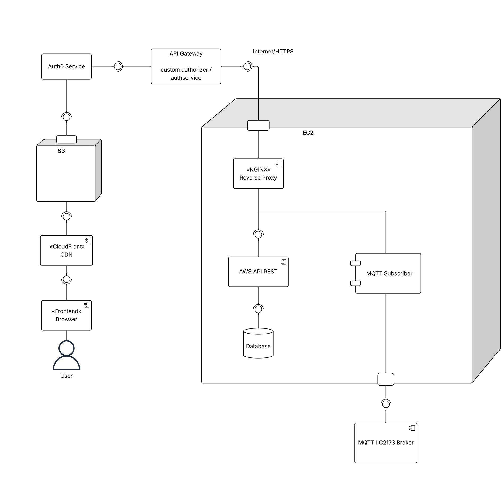

# Backend E1
- link de la página: https:arquijavi.me

## Diagrama UML



## 🚀 Tecnologías
- Node.js, Express
- Sequelize
- MQTT 
- Auth0 (servicio de autenticación/autorización)
- Docker

## 📦 Instalación Local

### Prerrequisitos
- Node.js 18+
- npm
- Docker y Docker Compose
- PostgreSQL
- Broker MQTT (Mosquitto, EMQX, etc)
- Cuenta Auth0 configurada

### Pasos de instalación

1. **Clonar el repositorio**
   ```bash
   git clone https://github.com/1982739/backend_arquisis.git
   cd backend_arquisis
   ```

2. **Instalar dependencias**
   ```bash
   npm install
   ```

3. **Configurar variables de entorno**
   ```bash
   cp .env.example .env
   # Edita .env con tus valores
   ```

El .env solo requiere las credenciales de Postgres que se usarán al ejecutarlo en local (nombre de usuario, clave, nombre de base de datos, host). El resto de los datos (las credenciales de Auth0 y de MQTT, la API y el ID de grupo) deben quedar tal cual están en el ejemplo.

4. **Correr el backend**
     ```bash
     docker-compose up --build
     ```

La base de datos se genera sola con el docker-compose; no es necesario hacerla a mano. En caso de, se usaría npm sequelize db:migrate.

## 📝 Ejecución

- `npm start`: Inicia el servidor en modo producción.
- `npm run dev`: Modo desarrollo con nodemon.
- `npm run migrate`: Ejecuta las migraciones de la base de datos.
- `npm test`: Ejecuta los tests.