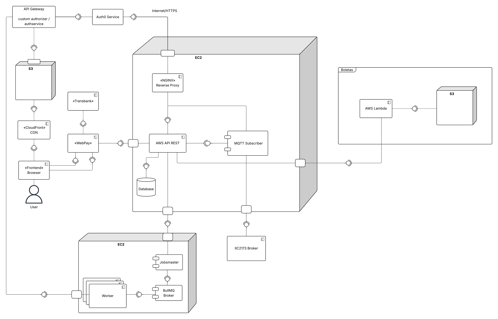

# Backend E2
- link de la página: https://arquijavi.me

## Diagrama UML


## 🚀 Tecnologías
- Node.js, Express
- Sequelize
- MQTT 
- Auth0 (servicio de autenticación/autorización)
- Docker

## 📦 Instalación Local

### Prerrequisitos
- Node.js 18+
- npm
- Docker y Docker Compose
- PostgreSQL
- Broker MQTT (Mosquitto, EMQX, etc)
- Cuenta Auth0 configurada

### Pasos de instalación

1. **Clonar el repositorio**
   ```bash
   git clone https://github.com/1982739/backend_arquisis.git
   cd backend_arquisis
   ```

2. **Instalar dependencias**
   ```bash
   npm install
   ```

3. **Configurar variables de entorno**
   ```bash
   cp .env.example .env
   # Edita .env con tus valores
   ```

El .env solo requiere las credenciales de Postgres que se usarán al ejecutarlo en local (nombre de usuario, clave, nombre de base de datos, host). El resto de los datos (las credenciales de Auth0 y de MQTT, la API y el ID de grupo) deben quedar tal cual están en el ejemplo.

4. **Correr el backend**
     ```bash
     docker-compose up --build
     ```

La base de datos se genera sola con el docker-compose; no es necesario hacerla a mano. En caso de, se usaría npm sequelize db:migrate.

## 📝 Ejecución

- `npm start`: Inicia el servidor en modo producción.
- `npm run dev`: Modo desarrollo con nodemon.
- `npm run migrate`: Ejecuta las migraciones de la base de datos.
- `npm test`: Ejecuta los tests.

## 📝 WebPay

Para conectarse a WebPay, el backend usa un WEBPAY_COMMERCE_CODE y un WEBPAY_API_KEY. Similar a auth0, se determina una URL de retorno después de un pago exitoso.

Desde el backend, el flujo de WebPay para el pago de las visitas comienza con el llamado de POST a /webpay/create. Aquí se recoge el precio de la propiedad que se desea comprar, se genera una transacción de WebPay y se genera una Request. Se notifica al listener en el canal /properties/request.

Aquí el usuario ingresa su número de tarjeta, RUT, etc. Una vez está terminada la transacción, WebPay entrega un token_ws al frontend, que luego es enviado al backend para confirmar la compra. Acá se hace commit de la transacción y se registra el Request como aprobado, rechazado o anulado según el response code del resultado del commit. Además, a partir de la información de la propiedad, se le pide al JobMaster una nueva tarea para la cola, generar las recomendaciones de nuevas propiedades.
Hecho esto, se notifica al listener por /properties/validation el resultado de la transacción, sea cual sea. Finalmente, se le devuelve la información sobre el resultado de la transacción al frontend. 

## 📝 Workflow CI/CD

En la ruta .github/workflows/backend-ci.yml se encuentra el archivo con las instrucciones del workflow de CI para el backend.

El propósito del workflow es automatizar la creación de imágenes de Docker para los servicios del backend (la API y el listener) y luego las sube a sus repositorios de ECR públicos. Para esta entrega no está implementado el deploy, pero a futuro también permitirá que el EC2 leerá las imágenes recién publicadas para actualizarse con el nuevo build automáticamente. El testeo se ejecuta en cada pull request a main o develop, y la subida de las imágenes se ejecuta en cada push a main.

Utilizando Github Actions, acciones de AWS y comandos de la consola, se hace lo siguiente:
1. Checkout del commit en cuestión.
2. Se inicia Node.
3. Se instalan todas las dependencias, leídas del package.json.
4. Configuración de credenciales de AWS, tomadas de los Secrets del repositorio. Permite acceder a los ECR.
5. Login a AWS para usar las ECR públicas.  
6. Build de la imagen. Se ejecuta el build de Docker.
7. Se pushea la imagen al ECR. Este paso solo se realiza en los pushes al branch (específicamente main), para no hacerlo en cada pull request.


## Serverless

1. En un archivo serverless.yml declarar permisos "s3:PutObject"- "s3:GetObject" para pode subir y ver las boletas en la S3
2. en archivo serverless.js en procider indicar región de AWS y nombre del BUCKET 
3. archivo boletahandler.js se encarga de generar la boleta mediante generateInvoice.js y de subir la boleta mediante uploadToS3.js
4. `serverless deploy` Para realizar deploy de la aplicación a la lambda
5. Hacer un POST HTTP al url de la lambda para probar su uso